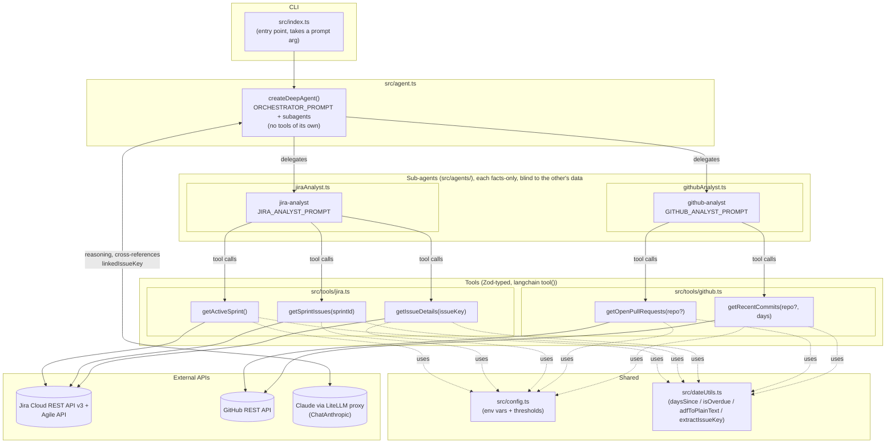

# Sprint Manager Agent (v0)

A single [DeepAgents](https://github.com/langchain-ai/deepagentsjs) agent that reads live data
from a Jira Cloud project (`SMA`) and a GitHub repo, and produces a sprint status/risk summary —
flagging blocked or stalled tickets, PRs that have sat unreviewed, and anything overdue.

v0 is deliberately **one agent, all tools, no sub-agents** — the goal is to see where a single
agent struggles before splitting anything up.

## Architecture



**Design principles**

- Tools return **pre-digested, computed facts** (`daysSinceUpdate`, `isOverdue`, `ageDays`,
  `isStale`, `reviewState`, `linkedIssueKey`) — no agent does date math or regex extraction
  itself.
- Thresholds (`STALE_TICKET_DAYS`, `STALE_PR_DAYS`) live in one place: `src/config.ts`.
- The two sub-agents are **read-only and facts-only** — they fetch and report data but never
  judge sprint health or look at each other's data.
- **Only the orchestrator cross-references Jira against GitHub**, matching via `linkedIssueKey`
  (extracted from PR titles/bodies and commit messages) rather than trusting Jira status at
  face value (e.g. a ticket "In Review" with no recent PR review activity is a risk, not a
  healthy ticket), and it grounds every claim in a specific issue key or PR number.

## Setup

```bash
npm install
cp .env.example .env   # fill in Jira + GitHub credentials
npm run dev            # runs with the default prompt
npm run dev -- "What's blocking SMA-42?"
```

Required environment variables (see `.env.example`):

| Variable | Purpose |
|---|---|
| `JIRA_BASE_URL` | e.g. `https://your-domain.atlassian.net` |
| `JIRA_EMAIL` / `JIRA_API_TOKEN` | Jira Basic auth |
| `JIRA_PROJECT_KEY` | Defaults to `SMA` |
| `GITHUB_TOKEN` | GitHub PAT |
| `GITHUB_OWNER` / `GITHUB_REPO` | Target repo |
| `AGENT_MODEL` | Bedrock model id, e.g. `bedrock:us.anthropic.claude-sonnet-4-5-20250929-v1:0` |
| `AWS_REGION` / `AWS_PROFILE` (or `AWS_ACCESS_KEY_ID` + `AWS_SECRET_ACCESS_KEY`) | Bedrock auth — uses the standard AWS SDK credential chain |

## Project structure

```
src/
  config.ts       env vars + thresholds
  dateUtils.ts    shared date/text helpers used by both tool files
  tools/jira.ts   getActiveSprint, getSprintIssues, getIssueDetails
  tools/github.ts getOpenPullRequests, getRecentCommits
  agent.ts        createDeepAgent + systemPrompt (not yet built)
  index.ts        CLI entry (not yet built)
```
