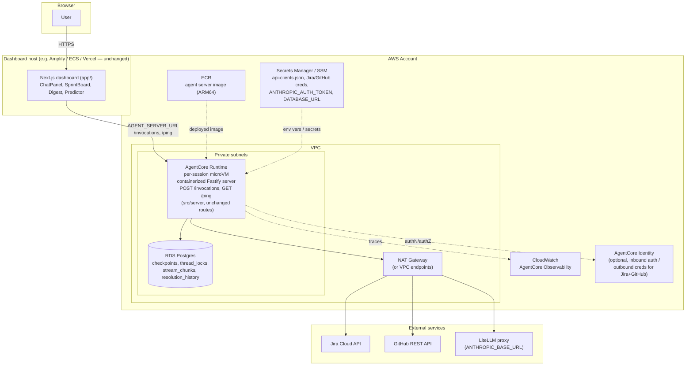

# Deploying SprintManager's agents on AWS Bedrock AgentCore

## Context

SprintManager currently runs its agent logic in two places: a one-shot CLI (`src/index.ts`) and a standalone Fastify server (`src/server/`) that the Next.js dashboard talks to over HTTP. There is **no existing deployment infrastructure** — no Dockerfile, no IaC (CDK/Terraform/CloudFormation), no CI/CD workflows. `README.md` only documents running `npm run server:build && npm run server:start` on a host you manage yourself, with all state (LangGraph checkpoints via `PostgresSaver`, thread locks, stream chunks) already externalized to a single Postgres instance via `DATABASE_URL` — which is exactly the shape AgentCore Runtime expects (stateless container, external state).

This doc is a feasibility assessment and a phased adoption path for running the agent server on **AWS Bedrock AgentCore** instead of self-managed hosting — not a full implementation. Validate the approach before starting code changes.

## What AgentCore actually is (relevant pieces only)

AgentCore is a modular platform (GA Oct 2025), not one service. The pieces that matter here:

- **Runtime** — serverless, per-session microVM hosting for a containerized agent. Framework-agnostic (works fine with LangGraph/DeepAgents). Supports up to 8-hour sessions, SSE and WebSocket streaming, 100MB payloads.
- **Gateway** — turns existing APIs/Lambdas into MCP-compatible tools. Not needed here — SprintManager's Jira/GitHub tools are plain `langchain` `tool()` wrappers already; no reason to route them through Gateway.
- **Identity** — inbound JWT/OAuth/SigV4 auth, outbound auth to third-party services (Jira, GitHub). Could eventually replace the hand-rolled `api-clients.json` key scheme in `src/server/apiClients.ts`, but that's a separate decision, not a prerequisite.
- **Memory** — AgentCore's own conversation memory service. **Not needed** — SprintManager already has its own LangGraph `PostgresSaver` checkpointer (`src/server/checkpointer.ts`) and would keep using it rather than migrating to AgentCore Memory.
- **Observability** — OTEL-based tracing via CloudWatch. Would sit alongside the existing Langfuse tracing (`src/tracing.ts`), not replace it necessarily.

## The concrete Runtime container contract

This is the part that actually constrains implementation:

| Requirement | Value |
|---|---|
| Listen host/port | `0.0.0.0:8080` |
| Platform | **ARM64** container (hard requirement) |
| Primary endpoint | `POST /invocations` — JSON in, JSON or SSE out |
| Health check | `GET /ping` — must return `{"status": "Healthy" \| "HealthyBusy"}` |
| Streaming | `Content-Type: text/event-stream`, `data: {...}` lines |
| Session identity | `X-Amzn-Bedrock-AgentCore-Runtime-Session-Id` header |
| Networking | ENIs placed in your VPC subnets; private resources (RDS/Postgres) reachable over private IPs with the right security groups; NAT gateway (or VPC endpoints) needed for outbound internet (Jira Cloud, GitHub API, the LiteLLM proxy endpoint) |

Sources:
- [What is Amazon Bedrock AgentCore](https://docs.aws.amazon.com/bedrock-agentcore/latest/devguide/what-is-bedrock-agentcore.html)
- [AgentCore Runtime overview](https://docs.aws.amazon.com/bedrock-agentcore/latest/devguide/agents-tools-runtime.html)
- [HTTP protocol contract](https://docs.aws.amazon.com/bedrock-agentcore/latest/devguide/runtime-http-protocol-contract.html)
- [VPC networking for Runtime](https://docs.aws.amazon.com/bedrock-agentcore/latest/devguide/agentcore-vpc.html)
- [Network connectivity patterns for AgentCore Runtime](https://aws.amazon.com/blogs/networking-and-content-delivery/network-connectivity-patterns-for-agents-deployed-on-amazon-bedrock-agentcore-runtime/)

## Architecture diagram (AgentCore deployment)

Notes on the diagram:
- The dashboard host is deliberately unlabeled/flexible — it isn't part of this migration, it just needs its `AGENT_SERVER_URL` pointed at the new Runtime endpoint.
- `Runtime` is one logical box but AgentCore actually spins up a fresh microVM per session — there's no fixed "server" to point a load balancer at the way `README.md` currently describes for self-hosting.
- `Identity` and `CW` (Observability) are drawn as optional/dotted since they're follow-on decisions (see Recommended phased approach, step 4), not required for the initial migration.
- If Postgres already lives outside AWS (e.g. a managed provider elsewhere), the `RDS` box becomes an external box reached over the NAT path instead of the private VPC path — the VPC-peering choice only matters if you also move Postgres to RDS.

## Mapping onto the current architecture

**Good fit, low friction:**
- Fastify server is already stateless per-process (README explicitly documents this: "any number of replicas can sit behind a load balancer as long as they point at the same database"). That's exactly the assumption Runtime's per-session microVM model makes.
- All durable state already lives in Postgres (`checkpointer.ts`, `locks.ts`, `streamChunks.ts`) via one `DATABASE_URL` — no in-process state to lose when a session's microVM is torn down.
- Existing `POST /invoke/stream` SSE output maps directly onto `/invocations`' SSE mode; the event schema (`token`, `tool_call`, `tool_result`, `subagent_start`/`end`, `done`, `error`) doesn't need to change, just be reachable at the right path.

**Friction points to resolve:**
1. **No Dockerfile / ARM64 build.** Need a new `Dockerfile` (Node + `tsc` build of `src/server`), built for `linux/arm64`. This is new work, not a port of anything existing.
2. **Route surface mismatch.** AgentCore wants one `/invocations` (+ `/ping`) entry point; today's server exposes several distinct routes (`/invoke`, `/invoke/stream`, `/threads/:id/stream`, `/threads/:id/cancel`, `/sprint`, `/predict/:issueKey`, `/internal/collect-resolution-history`). Two options: (a) run the existing Fastify app as-is behind Runtime and just satisfy `/ping` + treat `/invocations` as an alias for `/invoke/stream` (Runtime doesn't forbid extra routes, it just requires those two to exist) — likely the least invasive; or (b) fully adopt AgentCore's session/invocation model and drop the custom `thread_locks`/resume machinery in favor of Runtime's own session isolation. **(a) is recommended** — the existing resumable-streaming/cancellation design (`runRegistry.ts`, `stream_chunks` table) is more capable than what Runtime gives you for free (same-replica-only cancel, no cross-replica resume either way), so there's no clear win in ripping it out.
3. **Cross-replica limitations carry over unchanged.** `runRegistry.ts`'s in-memory `AbortController`/listener map is already same-replica-only; Runtime's per-session microVM model doesn't fix or worsen this — cancel/resume still only work within a session's own microVM, which is arguably a closer match than today's arbitrary-replica load balancing.
4. **Networking.** Postgres (`DATABASE_URL`), Jira Cloud, GitHub API, and the LiteLLM proxy (`ANTHROPIC_BASE_URL`) all need to be reachable from the Runtime container's VPC — private IP route to RDS if Postgres is moved to RDS-in-VPC, NAT/VPC-endpoint route for the three external HTTPS endpoints.
5. **Secrets.** `api-clients.json` (gitignored, loaded once at process start by `src/server/apiClients.ts`) and Jira/GitHub/LiteLLM credentials currently come from local env/files — would move to Secrets Manager or SSM Parameter Store, injected as container env vars at deploy time.
6. **The dashboard (`app/`) is unaffected.** It only ever talks to the agent server over HTTP via `AGENT_SERVER_URL`; it would keep running wherever it runs today (or on Amplify/ECS/Vercel) and just point at the new Runtime endpoint URL.
7. **`digest`/`_resolutionCollector.ts` background intervals.** These are `setInterval`-based loops living inside the long-running dashboard Next.js process, not the agent server — they're orthogonal to this migration and keep working unchanged as long as they can still reach the Runtime endpoint over HTTP.

## Recommended phased approach

1. **Spike**: containerize `src/server` (new ARM64 `Dockerfile`, `npm run server:build` + `node dist/server/index.js` as entrypoint), add a `/ping` route to `src/server/routes.ts`, and deploy manually via the AgentCore CLI/console against a throwaway RDS Postgres — validate `/invocations` streaming actually flows through end-to-end from a raw `curl`.
2. **Networking**: stand up the VPC config (private subnets + NAT or VPC endpoints) so the container can reach Postgres, Jira, GitHub, and the LiteLLM proxy; move `api-clients.json` and other secrets to Secrets Manager/SSM.
3. **Wire the dashboard** at the new Runtime invoke URL (just an `AGENT_SERVER_URL` env change in `app/api/_lib/agentServer.ts`'s consumers) and confirm chat/digest/sprint/predict all still work through the proxy routes unchanged.
4. **Decide later, not now**: whether to adopt AgentCore Identity (replacing `api-clients.json`) or AgentCore Observability (alongside/instead of Langfuse) — neither blocks the core migration and both are independent follow-ups.

## Verification

- Local: `docker buildx build --platform linux/arm64 -t sprintmanager-agent .` builds cleanly; `docker run -p 8080:8080 ...` responds `200` on `GET /ping` and streams SSE on `POST /invocations`.
- AWS: deploy via AgentCore CLI (`agentcore launch` or equivalent) to a dev account; confirm `GET /threads/:id/history`, `POST /invoke/stream`, and the resume/cancel routes all work against the deployed endpoint the same way they do locally today.
- End-to-end: point a local checkout of the dashboard's `AGENT_SERVER_URL` at the deployed Runtime endpoint and exercise the chat, digest, sprint, and predict tabs.
