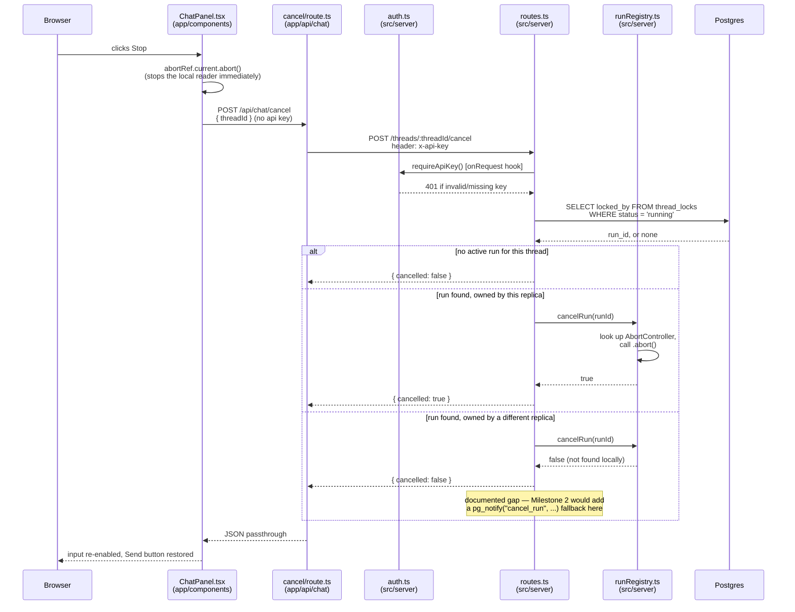

# Cancel (Stop button)

A side effect of [Resume after refresh](sequence-resume.md): since a browser
disconnect no longer aborts the run, the Stop button can't work by simply
closing the connection anymore. It now aborts its own local reader
immediately (so the UI stops right away) *and* asks the server explicitly to
cancel the run.

Same-replica only today — `runRegistry.ts`'s abort-controller map only knows
about runs executing on this process. If the run lives on a different
replica, this is a documented no-op; cross-replica cancel would need the same
`LISTEN`/`NOTIFY` channel that cross-replica resume would (see
[Resume after refresh](sequence-resume.md)).

See also: [Chat](sequence-chat.md), [Resume after refresh](sequence-resume.md).

