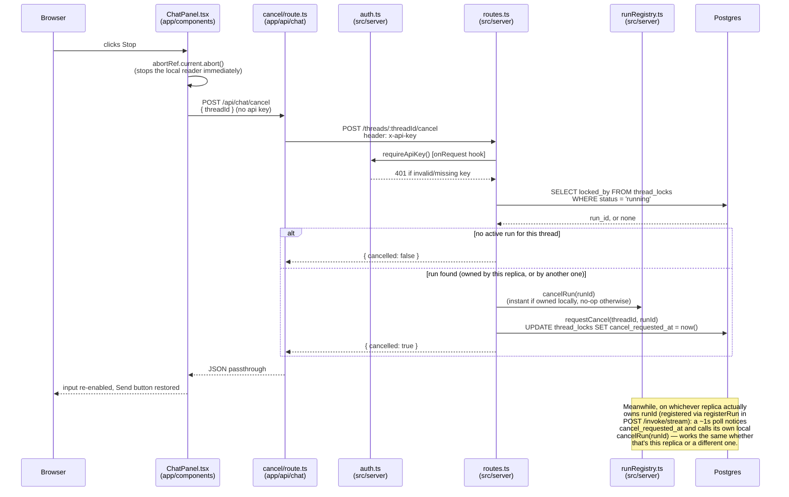

# Cancel (Stop button)

A side effect of [Resume after refresh](sequence-resume.md): since a browser
disconnect no longer aborts the run, the Stop button can't work by simply
closing the connection anymore. It now aborts its own local reader
immediately (so the UI stops right away) *and* asks the server explicitly to
cancel the run.

Works across replicas: the same-replica path (`runRegistry.ts`'s
abort-controller map) is tried first for an instant abort, but the request is
also always durably recorded via `requestCancel()` (`locks.ts`,
`thread_locks.cancel_requested_at`) regardless of whether the local attempt
found anything. Whichever replica actually owns the run polls that column
(~1s interval, alongside its `registerRun`/`unregisterRun` lifecycle in
`routes.ts`) and cancels itself once it sees the flag — no `LISTEN`/`NOTIFY`
or replica-to-replica messaging needed, since `thread_locks` is already the
shared source of truth every replica can read.

See also: [Chat](sequence-chat.md), [Resume after refresh](sequence-resume.md).

```mermaid
sequenceDiagram
    participant Browser
    participant ChatPanel as ChatPanel.tsx<br/>(app/components)
    participant NextRoute as cancel/route.ts<br/>(app/api/chat)
    participant AgentAuth as auth.ts<br/>(src/server)
    participant Routes as routes.ts<br/>(src/server)
    participant RunRegistry as runRegistry.ts<br/>(src/server)
    participant Postgres

    Browser->>ChatPanel: clicks Stop
    ChatPanel->>ChatPanel: abortRef.current.abort()<br/>(stops the local reader immediately)
    ChatPanel->>NextRoute: POST /api/chat/cancel<br/>{ threadId } (no api key)
    NextRoute->>Routes: POST /threads/:threadId/cancel<br/>header: x-api-key
    Routes->>AgentAuth: requireApiKey() [onRequest hook]
    AgentAuth-->>Routes: 401 if invalid/missing key
    Routes->>Postgres: SELECT locked_by FROM thread_locks<br/>WHERE status = 'running'
    Postgres-->>Routes: run_id, or none

    alt no active run for this thread
        Routes-->>NextRoute: { cancelled: false }
    else run found (owned by this replica, or by another one)
        Routes->>RunRegistry: cancelRun(runId)<br/>(instant if owned locally, no-op otherwise)
        Routes->>Postgres: requestCancel(threadId, runId)<br/>UPDATE thread_locks SET cancel_requested_at = now()
        Routes-->>NextRoute: { cancelled: true }
    end

    NextRoute-->>ChatPanel: JSON passthrough
    ChatPanel-->>Browser: input re-enabled, Send button restored

    Note over Postgres,RunRegistry: Meanwhile, on whichever replica actually<br/>owns runId (registered via registerRun in<br/>POST /invoke/stream): a ~1s poll notices<br/>cancel_requested_at and calls its own local<br/>cancelRun(runId) — works the same whether<br/>that's this replica or a different one.
```
