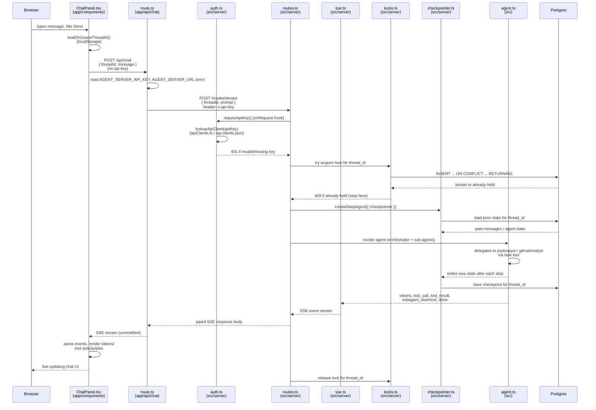

# Chat (agent conversation)

Every route funnels through `app/api/_lib/agentServer.ts`, which attaches
`x-api-key` server-side so the browser never sees it. Chat is the only flow
that touches the model: it acquires a per-thread lock, replays checkpointed
state, runs the orchestrator, and streams tokens back over SSE.

See also: [Thread history](sequence-history.md), [Sprint data view](sequence-sprint.md).

