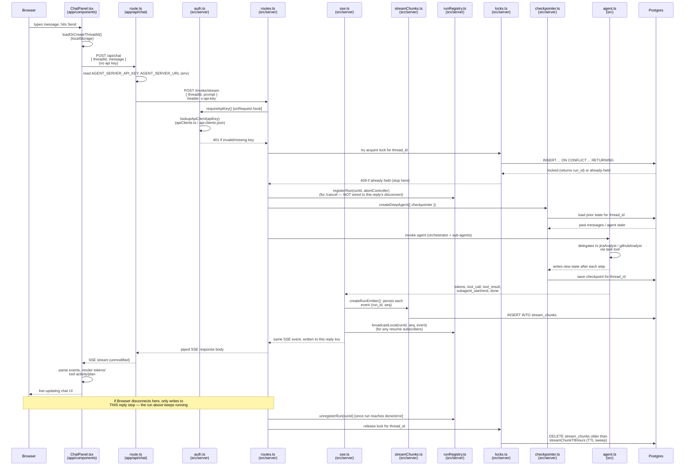

# Chat (agent conversation)

Every route funnels through `app/api/_lib/agentServer.ts`, which attaches
`x-api-key` server-side so the browser never sees it. Chat is the only flow
that touches the model: it acquires a per-thread lock, replays checkpointed
state, runs the orchestrator, and streams tokens back over SSE.

The run is deliberately **not** tied to this one browser connection anymore:
a disconnect (tab close, refresh, network blip) only stops writes to this
particular reply — the run keeps going server-side to completion, and every
event is durably persisted as it's emitted so a reconnecting client can
replay it. See [Resume after refresh](sequence-resume.md) for that path, and
[Cancel](sequence-cancel.md) for how Stop works now that a disconnect alone
no longer kills the run.

See also: [Thread history](sequence-history.md), [Sprint data view](sequence-sprint.md).

