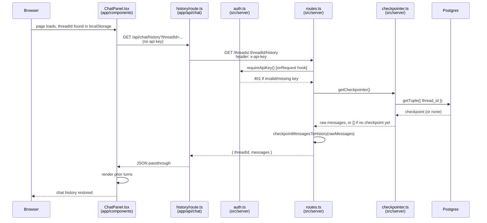

# Thread history (resuming a chat session)

Fired once, on mount, so the ChatPanel can replay prior turns for a `threadId`
recalled from `localStorage` — no agent run involved, just a checkpoint read.

See also: [Chat](sequence-chat.md), [Sprint data view](sequence-sprint.md).

