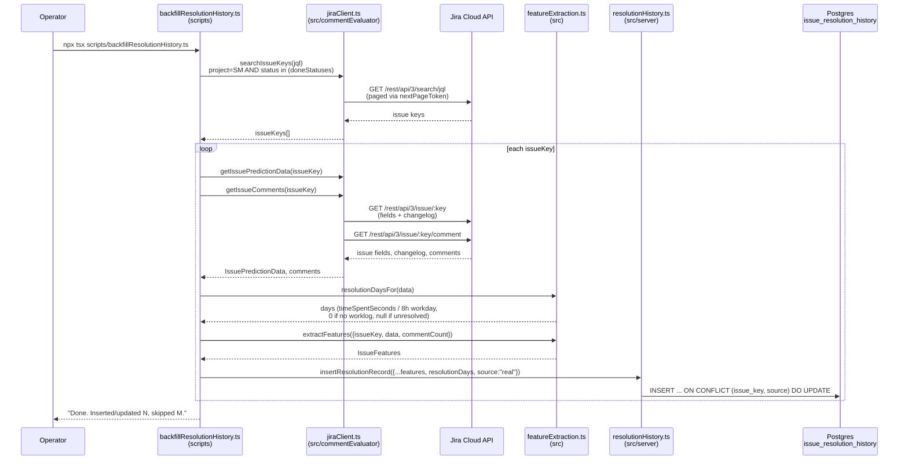
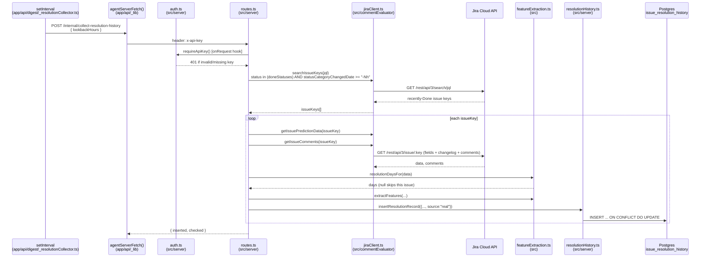
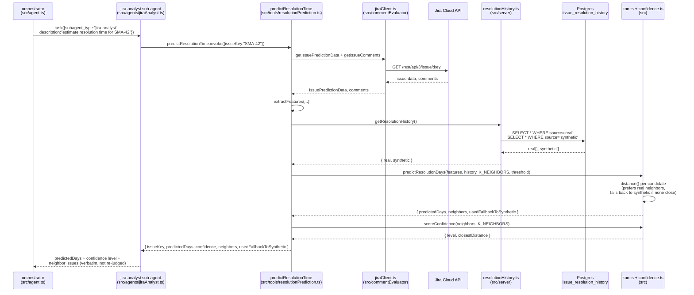

# Issue resolution history & prediction

Three independent flows around `issue_resolution_history`: two that populate
it (a one-time manual backfill, and an ongoing background collector) and one
that reads it (the orchestrator's resolution-time prediction, via a k-NN
lookup over that table). None of these share a request path with
[Chat](sequence-chat.md)/[Sprint](sequence-sprint.md) beyond the prediction
flow being one thing the orchestrator can call into during a chat turn.

## 1. Manual backfill (`scripts/backfillResolutionHistory.ts`)

Run once (or re-run any time) by hand, directly against Jira and Postgres —
no agent server involved. Upserts by `(issue_key, source)`, so re-running is
always safe.

## 2. Background collector (dashboard scheduler → agent server)

Started lazily on the dashboard's first request (same pattern as the digest
scheduler — no cron/webhook infra exists in this repo), then reruns on
`RESOLUTION_COLLECTOR_INTERVAL_MINUTES` (default 20 minutes, matching the
Sprint Health Digest's cadence). Looks back several intervals (3x, so ~1h by
default) so a slow/missed tick can't let a newly-Done issue fall through the
gap.

## 3. Live prediction (chat → orchestrator → jiraAnalyst)

Triggered whenever a user asks something like "how long will SMA-42 take?"
during a normal [chat](sequence-chat.md) turn — this is the orchestrator
delegating to the `jira-analyst` sub-agent via deepagents' `task` tool, one
step inside that larger flow, not a separate HTTP route.

