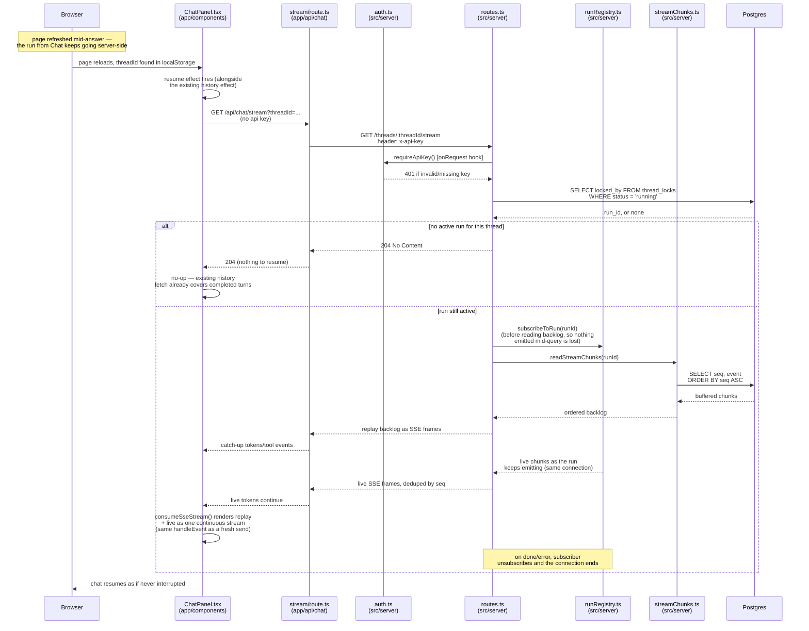

# Resume after refresh (token-level replay)

Fired alongside [Thread history](sequence-history.md) on every ChatPanel
mount — where history only ever recovers *completed* prior turns, this path
recovers a turn that's still in progress. It works because
[Chat](sequence-chat.md) no longer aborts the run when a browser disconnects:
the run keeps going server-side, and every event it emits is durably recorded
in `stream_chunks` (via `createRunEmitter` in `sse.ts`) the instant it
happens. Reconnecting just means reading that backlog from the top, then
falling in step with whatever's still being emitted live.

This is same-replica only today: chunk fan-out to a live subscriber goes
through the in-process `runRegistry.ts`, not a cross-replica channel. A
reconnect that lands on a different replica than the one running the agent
would need Postgres `LISTEN`/`NOTIFY` to tail live chunks — not built yet,
since the deployment is a single Fastify process.

See also: [Chat](sequence-chat.md), [Thread history](sequence-history.md), [Cancel](sequence-cancel.md).

