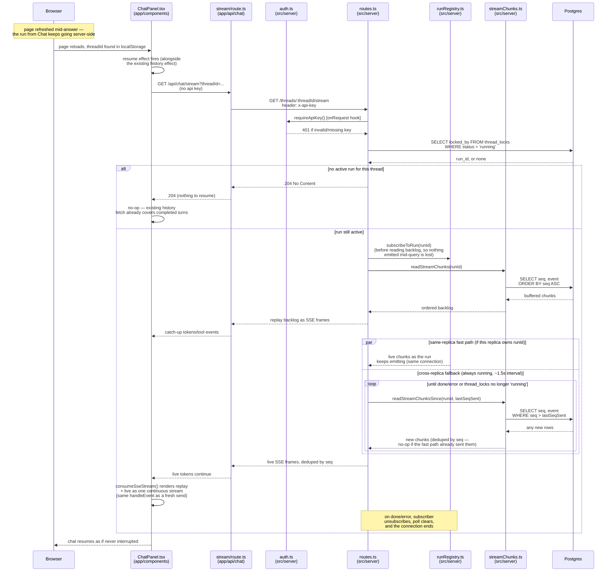

# Resume after refresh (token-level replay)

Fired alongside [Thread history](sequence-history.md) on every ChatPanel
mount — where history only ever recovers *completed* prior turns, this path
recovers a turn that's still in progress. It works because
[Chat](sequence-chat.md) no longer aborts the run when a browser disconnects:
the run keeps going server-side, and every event it emits is durably recorded
in `stream_chunks` (via `createRunEmitter` in `sse.ts`) the instant it
happens. Reconnecting just means reading that backlog from the top, then
falling in step with whatever's still being emitted live.

Works across replicas: `subscribeToRun` (`runRegistry.ts`) still gives an
instant, zero-latency path when the reconnect happens to land on the same
replica that's running the agent loop — but every connection also starts a
~1.5s poll of `readStreamChunksSince` (`streamChunks.ts`) as a fallback. That
poll is a no-op on the owning replica (the local push already delivered those
rows, deduped by `seq`), but on any other replica it's the only way live
chunks ever arrive, since `subscribeToRun` there just finds no subscriber
list and does nothing. The same poll also checks `thread_locks.status` to
notice the run finishing even if this replica never saw a `done`/`error`
chunk directly.

See also: [Chat](sequence-chat.md), [Thread history](sequence-history.md), [Cancel](sequence-cancel.md).

```mermaid
sequenceDiagram
    participant Browser
    participant ChatPanel as ChatPanel.tsx<br/>(app/components)
    participant NextRoute as stream/route.ts<br/>(app/api/chat)
    participant AgentAuth as auth.ts<br/>(src/server)
    participant Routes as routes.ts<br/>(src/server)
    participant RunRegistry as runRegistry.ts<br/>(src/server)
    participant StreamChunks as streamChunks.ts<br/>(src/server)
    participant Postgres

    Note over Browser: page refreshed mid-answer —<br/>the run from Chat keeps going server-side
    Browser->>ChatPanel: page reloads, threadId found in localStorage
    ChatPanel->>ChatPanel: resume effect fires (alongside<br/>the existing history effect)
    ChatPanel->>NextRoute: GET /api/chat/stream?threadId=...<br/>(no api key)
    NextRoute->>Routes: GET /threads/:threadId/stream<br/>header: x-api-key
    Routes->>AgentAuth: requireApiKey() [onRequest hook]
    AgentAuth-->>Routes: 401 if invalid/missing key
    Routes->>Postgres: SELECT locked_by FROM thread_locks<br/>WHERE status = 'running'
    Postgres-->>Routes: run_id, or none

    alt no active run for this thread
        Routes-->>NextRoute: 204 No Content
        NextRoute-->>ChatPanel: 204 (nothing to resume)
        ChatPanel->>ChatPanel: no-op — existing history<br/>fetch already covers completed turns
    else run still active
        Routes->>RunRegistry: subscribeToRun(runId)<br/>(before reading backlog, so nothing<br/>emitted mid-query is lost)
        Routes->>StreamChunks: readStreamChunks(runId)
        StreamChunks->>Postgres: SELECT seq, event<br/>ORDER BY seq ASC
        Postgres-->>StreamChunks: buffered chunks
        StreamChunks-->>Routes: ordered backlog
        Routes-->>NextRoute: replay backlog as SSE frames
        NextRoute-->>ChatPanel: catch-up tokens/tool events

        par same-replica fast path (if this replica owns runId)
            RunRegistry-->>Routes: live chunks as the run<br/>keeps emitting (same connection)
        and cross-replica fallback (always running, ~1.5s interval)
            loop until done/error or thread_locks no longer 'running'
                Routes->>StreamChunks: readStreamChunksSince(runId, lastSeqSent)
                StreamChunks->>Postgres: SELECT seq, event<br/>WHERE seq > lastSeqSent
                Postgres-->>StreamChunks: any new rows
                StreamChunks-->>Routes: new chunks (deduped by seq —<br/>no-op if the fast path already sent them)
            end
        end
        Routes-->>NextRoute: live SSE frames, deduped by seq
        NextRoute-->>ChatPanel: live tokens continue
        ChatPanel->>ChatPanel: consumeSseStream() renders replay<br/>+ live as one continuous stream<br/>(same handleEvent as a fresh send)
        Note over Routes,RunRegistry: on done/error, subscriber<br/>unsubscribes, poll clears,<br/>and the connection ends
    end

    ChatPanel-->>Browser: chat resumes as if never interrupted
```
