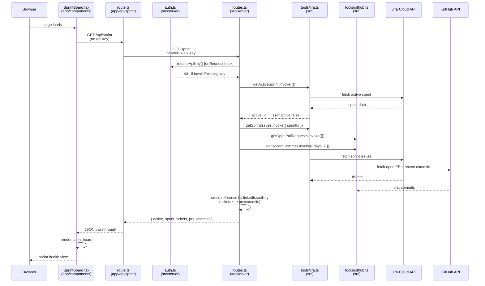

# Sprint data view (no agent involved)

`SprintBoard.tsx` bypasses the orchestrator entirely — this is a plain data
fetch-and-join, not a conversation, so there's no lock/checkpoint/model call
anywhere in the path.

See also: [Chat](sequence-chat.md), [Thread history](sequence-history.md).

